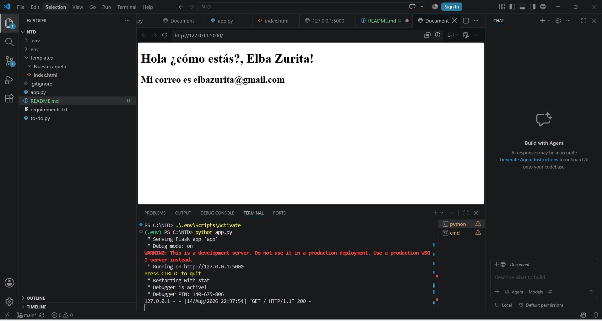
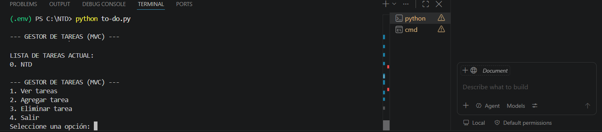

# Aplicación Flask - To-Do List

Proyecto desarrollado para la actividad del curso NTD (Nuevas Tecnologías de Desarrollo) - Módulo 1: Patrón MVC y Repositorios de Código.

## Descripción

Aplicación web simple hecha con Flask que muestra una lista de tareas (to-do list) usando el patrón MVC.

## Requisitos previos

- Python 3.14 o superior
- Git

## Instrucciones para ejecutar el proyecto

### 1. Clonar el repositorio

git clone https://github.com/MrHuesitozzz/Aplicacion-Flask.git
cd Aplicacion-Flask

### 2. Crear el entorno virtual

python -m venv env

### 3. Activar el entorno virtual

**En Windows (PowerShell):**
.\env\Scripts\Activate

> Si da error de permisos, primero correr:
> Set-ExecutionPolicy -ExecutionPolicy RemoteSigned -Scope CurrentUser

### 4. Instalar las librerías necesarias

pip install -r requirements.txt

### 5. Ejecutar la aplicación

python app.py

La aplicación quedará corriendo en: http://127.0.0.1:5000

## Comandos de control de versiones utilizados

git init
git add .
git commit -m "Primer commit: app Flask y to-do list"
git branch -M main
git remote add origin https://github.com/MrHuesitozzz/Aplicacion-Flask.git
git push -u origin main

## Evidencia de ejecución

## Autor

Juan Esteban Pico Briceño